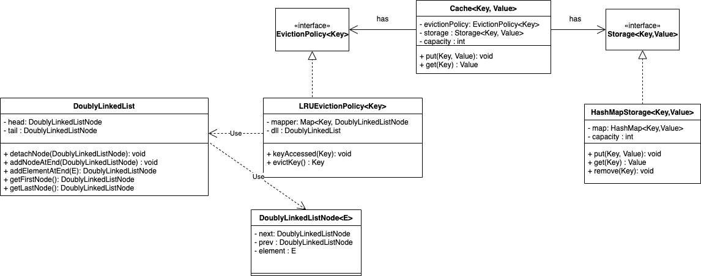

# Cache - Low level system design 
* Low level Design of a Cache
* Extensible cache design
* Eviction policies and key storages can be injected. 

## Problem statement
[Check here](Problem-Statement.md)

## Class Diagram

